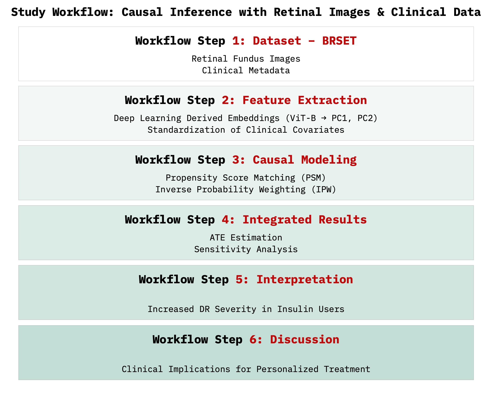

Causal inference and deep learning for diabetic retinopathy
===========================================================

This repository contains the implementation of our study titled **"Beyond correlation: multimodal causal inference and deep learning for assessing insulin's impact on diabetic retinopathy progression"**.



## Authors

- **Ali Salman** - Department of Medical Biotechnologies, University of Siena, Italy
- **Ernesto Iadanza** - Department of Medical Biotechnologies, University of Siena, Italy

## Abstract

Deep learning systems have revolutionized diabetic retinopathy (DR) screening, but their predictions remain essentially correlative and offer limited clinical guidance. In particular, the true impact of insulin therapy on DR progression remains debated. We address this challenge by embedding formal causal-inference techniques within a multimodal pipeline that fuses structured clinical data with retinal embeddings from a vision transformer, a type of artificial intelligence (AI) model. Our analysis draws on the Brazilian Multilabel Ophthalmological Dataset (BRSET), comprising 16,266 color fundus photographs from 8,524 patients, alongside metadata on diabetes duration, insulin status, comorbidities, and international clinical diabetic retinopathy (ICDR) grades. Clinical covariates were harmonized and $z$-standardized, while each photograph was encoded by the RetFound ViT-B backbone to yield a 1,024-dimensional retinal feature vector capturing subtle morphological variation. Using a balanced sample of insulin-treated and non-treated patients, we found insulin use consistently linked to worse DR grades. After adjustment for age and diabetes duration, insulin therapy was associated with an average increase of approximately two-thirds of an ICDR severity level. When we added features from retinal images, the estimated effect of insulin increased to nearly one full ICDR grade. This suggests that image-level differences may reveal disease severity not captured by clinical data. We confirmed the result through several robustness checks, including tighter matching, richer models, and different weighting methods. The effect was strongest in patients with long-term diabetes or those with hypertensive eye changes. This multimodal approach moves beyond black-box prediction and provides useful insight for managing diabetic retinopathy. It shows how causal AI can support better treatment decisions and help prevent vision loss.

## Citation

If you use this work, please cite it as:

```bibtex
@misc{salman2025als_ml_dl,
  author       = {Ali Salman and Ernesto Iadanza},
  title        = {Beyond correlation: multimodal causal inference and deep learning for assessing insulin's impact on diabetic retinopathy progression},
  year         = {2025},
  institution  = {Department of Medical Biotechnologies - University of Siena, Siena, Italy},
  note         = {Available on GitHub: https://github.com/alexsalman/brset_project},
  url          = {[https://github.com/alexsalman/GNB2025](https://github.com/alexsalman/brset_project)},
  urldate      = {2025-06-30}
}

